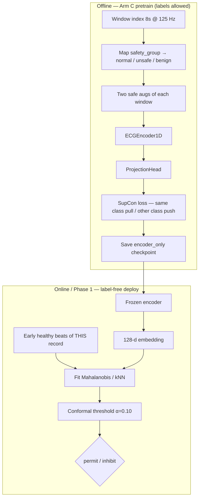

# Layer 3 — Complete status (Arm C: supervised contrastive / SupCon)

**Purpose:** One place that explains **Arm C** at the same depth as the A0 / A /
B status docs: why it exists, architecture choice + papers, code path, diagrams,
evaluation, caveats, current status, and future directions.

**Date:** July 2026 (updated: ladder C1/C2/C3 implemented and locally smoke-verified;
not yet run on cluster; not yet committed)  
**Canonical design spec:** [`LAYER3_ARM_C_SUPERVISED_SPEC.md`](LAYER3_ARM_C_SUPERVISED_SPEC.md)  
**Ladder spec (C1/C2/C3):** [`LAYER3_ARM_C_LADDER_SPEC.md`](LAYER3_ARM_C_LADDER_SPEC.md)  
**Code:** `Layer3/pipeline/layer3_supervised.py` (`SupConLoss`, ladder losses, label map)  
**Driver:** `Layer3/tools/pretrain_encoder.py` (`--ssl-objective supcon|supcon_oe|deepsad|supcon_hybrid`)

**Sibling docs:**
- A0 → `LAYER3_COMPLETE_STATUS_A0_FIRST.md`
- A → `LAYER3_COMPLETE_STATUS_A.md`
- A1 → `VICREG_A1_IMPLEMENTATION_PLAN.md`
- B → `LAYER3_COMPLETE_STATUS_B.md`
- B1 → `LAYER3_COMPLETE_STATUS_B1.md`
- C ladder (C1/C2/C3) → `LAYER3_ARM_C_LADDER_SPEC.md`
- Commands → `ZEROSHOT_CLUSTER_RUN_NOTES.md` + `cluster_jobs/07a_*`/`07b_*` (C), `14*`/`15*`/`16*`/`17_*` (C1/C2/C3)
- Metrics → `LAYER3_PHASE1_OUTPUT_METRICS.md`

---

## 0-summary. Where we are right now (quick scan)

```text
DONE
  - Arm C (SupCon) code reviewed: real, correct, passes all 5 safety/leakage checks
  - Class-balanced WeightedRandomSampler added (danger was ~5% of windows, spec
    called for balancing) + provenance fields (epochs/batch_size/seed/sampler)
  - Output dir names disambiguated (…seed0_100ep_8s_goldexcluded) so smoke and
    real runs cannot collide
  - C1 (supcon_oe) / C2 (deepsad) / C3 (supcon_hybrid) ladder IMPLEMENTED:
    new loss primitives (svdd_compactness_loss, outlier_exposure_loss) + frozen
    SVDD/SAD center + wired into pretrain_encoder.py as a C_FAMILY refactor
  - All of the above verified end-to-end with local CPU smoke runs (exit 0,
    correct loss composition, gold exclusion exact-match verified, encoder-only
    checkpoints confirmed) — torch 2.12.1+cpu is present on this laptop
  - 6 cluster job scripts (14a/b, 15a/b, 16a/b) + master runner (17) written,
    lint-clean, env-overridable for the sweep tail
  - LAYER3_ARM_C_LADDER_SPEC.md written (guardrail, sweep tail, expected-outcome table)

NOT YET DONE
  - Nothing has been committed to git — this entire Arm C + ladder body of work
    (code, 6+ docs, cluster scripts) is uncommitted working-tree state
  - No cluster run has happened. C, C1, C2, and C3 all still need a real
    100-epoch pretrain + Phase 1 eval on the MIT-BIH gold cohort
  - The A0/C/C1/C2/C3 comparison table in LAYER3_L2_A0_A_COMPARE.md is blank
  - C-ce (supervised cross-entropy) remains spec-only, not implemented

NEXT ACTION
  - Sync the repo to the cluster, run 07a/07b (C) then 17_run_c_ladder_sequential.sh
    (C1→C2→C3), fill the comparison table, read false-permit + CAV vs A0.
  - Decision rule: if nothing beats A0 or adds CAV, bank the negative and pivot
    to the Layer 2 operating-point / runtime work — do not keep adding SSL arms.
```

---

## 0. One-sentence framing for C

> Arm C uses **public ECG safety labels only during pretraining** (Supervised
> Contrastive / SupCon) so same-class windows cluster and danger is pushed away
> from normal; then it **discards the projection head** and deploys the **same
> label-free per-record healthy Mahalanobis/kNN + conformal veto** as every other
> arm.

```text
Question answered by C:
  "If we are allowed to use the labels we already have in public ECG to shape
   the encoder — but still must calibrate without danger labels at deploy —
   does the representation beat A0 / A / A1 / B on false-permit?"
```

**Critical distinction the SSL arms do not test:**

| Time | Labels? | Arm C |
| --- | --- | --- |
| Pretrain (offline, PhysioNet) | Yes | Used (SupCon on `safety_group`) |
| Deploy / calibration (patient session) | No | **Not used** — healthy baseline only |

SSL assumed “label-free deploy ⇒ label-free pretrain.” That implication is false.
Arm C separates **representation** (may be supervised) from **decision**
(must stay one-class).

---

## 1. What Arm C is

| Item | Definition |
| --- | --- |
| **Name** | C — supervised contrastive (SupCon) representation |
| **CLI** | `--ssl-objective supcon` |
| **Core paper** | **Khosla et al., 2020** — Supervised Contrastive Learning (NeurIPS) |
| **Input** | Same 8 s @ 125 Hz windows as A/A1/B (same window index) |
| **Labels** | `safety_group` from the window index (**pretrain only**) |
| **Views** | Two safe augmentations of each window (same ECGAugmentor as Arm A) |
| **Encoder** | Same `ECGEncoder1D` → 128-d |
| **Training-only head** | `ProjectionHead` — **discarded** after pretrain |
| **Runtime** | Identical to A/B: frozen encoder → L2/PCA → Mahalanobis/kNN → conformal |
| **What it is not** | Not a deploy-time classifier; not multi-lead; not C-ce (deferred variant — C-oe is implemented as ladder rung C2) |

**Place in the ladder:**

```text
A0 = handcrafted features + same scorer          (control floor)
A  = NT-Xent contrastive SSL                     (no labels)
A1 = VICReg non-contrastive SSL                  (no labels)
B  = masked recon + same-window consistency      (no labels)
B1 = masked + subject contrastive                (ablation, no labels)
C  = SupCon on public safety labels              ← this document
     (labels at PRETRAIN only; deploy label-free)
C1 = SupCon + outlier exposure                   (ladder, exploratory)
C2 = SVDD compact normal + outlier exposure       (ladder, exploratory — Deep SAD)
C3 = SupCon + SVDD + outlier exposure (hybrid)    (ladder, exploratory)
```

C1/C2/C3 are implemented and locally smoke-verified (see
[`LAYER3_ARM_C_LADDER_SPEC.md`](LAYER3_ARM_C_LADDER_SPEC.md)); **exploratory** —
tuned on the same 13 gold records already inspected, so any win needs confirmation
on an untouched cohort before it's a claim. A0 remains the deployable baseline.

Multi-lead is a **future appendix item**, not Arm C.

---

## 2. Why this architecture (design rationale + papers)

### 2.1 Design logic in one chain

```text
Operational constraint
  → at deploy we only have a short assumed-healthy baseline
  → decision MUST be one-class / personalized (Carrera 2019; Yu 2026)

But public ECG has abundant labels
  → we CAN shape the embedding offline (Hannun 2019; Ribeiro 2020)
  → without changing the deploy contract

Best geometry for our distance veto
  → same safety class clustered, danger far from normal
  → SupCon does exactly that (Khosla 2020)

Two-stage recipe from AD literature
  → learn representation, then fit one-class scorer
  → (Sohn 2021; Reiss 2021 / PANDA; Ruff 2021 review)
```

### 2.2 Why SupCon (not CE head, not Deep SVDD alone)

| Option | Why / why not as primary C |
| --- | --- |
| **SupCon (primary)** | Multi-positive InfoNCE with labels; builds the geometry our Mahalanobis/kNN reads; same aug story as Arm A so A↔C is a clean objective ablation |
| Cross-entropy encoder (C-ce) | Cheaper sanity control; weaker explicit geometry; **deferred** until C looks promising |
| Deep SVDD alone | Compact normal, but unsupervised and can collapse |
| Outlier-exposed SVDD / Deep SAD (C-oe) | Best “AD-shaped” merge (Ruff 2018/2020; Hendrycks 2019); **implemented as ladder rung C2** (`deepsad`), see `LAYER3_ARM_C_LADDER_SPEC.md` |

Primary C = **SupCon**. Variants stay in the spec until the primary result warrants them.

### 2.3 Why keep the personalized healthy baseline (do not drop it)

The baseline-stable fitting idea is the **spine** of Layer 3, not a side detail:

1. It is the only deploy contract that later pig/rat translation could reuse
   (no DANGEROUS labels on the animal to retrain a classifier).
2. It makes Arm C **fair**: labels may shape the encoder; they never set the
   threshold.
3. It matches Layer 2’s personalization philosophy → A0 vs C is a representation
   comparison under the same decision rule.
4. ZEROSHOT’s transferable idea is personalized healthy Mahalanobis, not a
   fixed global danger head.

### 2.4 Why A/B still matter next to C

| Arm family | Motivation |
| --- | --- |
| **A / A1 / B / B1** | Label-free encoders aimed at a representation that could later transfer under the one-class deploy contract (pig/human path; animal translation *intent*) |
| **C** | Human-in-domain **ceiling**: do public labels buy a better embedding than pure SSL / A0? |

Phase 1 still measures all arms on **MIT-BIH gold** under the same scorer.
Saying “A/B were for translation” is **design intent**, not a demonstrated
species-transfer result. Layer 3 remains **human research only** until animal data.

### 2.5 Related work (citations)

Citation style matches the literature review outline.

**Supervised / label-informed representation**
- **Khosla et al., 2020** — *NeurIPS*. SupCon; same-label positives, other labels
  as negatives — **core loss for Arm C**.
- **Chen et al., 2020 (SimCLR)** — *ICML*. NT-Xent base that SupCon extends;
  shared aug/backbone story with Arm A.
- **Kiyasseh et al., 2021 (CLOCS)** — *ICML*. Patient/space/time contrastive ECG;
  motivates label-aware pretraining under a fixed scorer.
- **Gopal et al., 2021 (3KG)** — *ML4H*. Physiology-aware ECG augmentations
  (safe augs for Arm C).

**Supervised ECG “ceiling”**
- **Hannun et al., 2019** — *Nature Medicine*. Cardiologist-level single-lead DNN.
- **Ribeiro et al., 2020** — *Nature Communications*. Deep 12-lead diagnosis.
- **Hong et al., 2020** — *Computers in Biology and Medicine*. DL-for-ECG review.

**Semi-supervised / outlier-exposed AD (motivates ladder rung C2 `deepsad`)**
- **Görnitz et al., 2013** — *JAIR*. Supervised AD with few labelled anomalies.
- **Hendrycks et al., 2019 (Outlier Exposure)** — *ICLR*.
- **Ruff et al., 2018 (Deep SVDD)** — *ICML*; **2020 (Deep SAD)** — *ICLR*;
  **2021** — *Proc. IEEE* unifying review.

**Two-stage representation → one-class scorer (our deploy split)**
- **Sohn et al., 2021** — *ICLR*. Learn representation, then one-class classifier.
- **Reiss et al., 2021 (PANDA)** — *CVPR*. Pretrained features + NN AD.
- **Perera & Patel, 2019** — *IEEE TIP*. Deep features for one-class.

**Same scorer family / personalization**
- **Carrera et al., 2019** — *Pattern Recognition*. Per-user normal model.
- **Jiang et al., 2024** — embedding-space ECG AD feasibility.
- **Yu, 2026 (ZEROSHOT)** — SSL + per-subject healthy Mahalanobis; supervised
  linear ≈ unsupervised SSL — the near-tie that **motivates testing Arm C**.

**Merged design in one sentence**

> Arm C combines **supervised-contrastive** representation learning (Khosla 2020)
> with a **two-stage frozen-encoder one-class deployment** (Sohn 2021; Reiss 2021)
> and **per-record healthy calibration** (Carrera 2019; Yu 2026): public labels
> shape geometry offline; the patient’s own unlabelled baseline sets the veto
> online.

---

## 3. System diagrams

### 3.1 Offline pretrain vs online deploy



### 3.2 SupCon forward pass (one picture)

```text
window x, safety label y ∈ {normal, unsafe, benign}

  → aug₁(x) → encoder → proj → z₁
  → aug₂(x) → encoder → proj → z₂

Concatenate batch views → 2B projections
Positives for an anchor = all other views with the SAME y
Negatives               = all other labels
Loss                    = multi-positive InfoNCE (temperature τ)

After training:
  discard proj head
  keep encoder only
  NEVER use class logits at runtime
```

### 3.3 Default label map (geometry we want)

```text
raw safety_group          → SupCon class
────────────────────────────────────────
NORMAL                    → normal
DANGEROUS + NOISE         → unsafe     (must be far from normal)
BENIGN_ABNORMAL           → benign     (own class; don't-care for false-permit)
AF_CONTEXT                → drop       (ambiguous policy; excluded by default)
```

**Why not 2-way normal/abnormal?** Folding benign into normal teaches “PVC ≈ sinus.”
Folding benign into unsafe teaches “PVC ≈ VT.” Keeping three classes avoids both
wrong boundaries while still pushing danger away from normal.

---

## 4. How C is trained (code path)

Entry: `Layer3/tools/pretrain_encoder.py` with `--ssl-objective supcon`.

```text
1. Load window index CSV (must contain safety_group)
2. Filters:
     --exclude-records-csv gold   → hold eval records out (leakage worse with labels)
     apply --label-map            → map + drop AF_CONTEXT; write _supcon_label_id
     fail-closed if a mapped class is empty
3. Optional --max-windows:
     stratified sample so smoke keeps ≥2 windows per class
4. ContrastiveECGDataset(return_label=True, apply_augmentations=True):
     load .npy slice → robust median/MAD normalize
     ECGAugmentor ×2 → (view_a, view_b, label_id)
5. Model:
     EncoderWithProjection(ECGEncoder1D + ProjectionHead)
6. Sampler:
     sqrt-tempered inverse-frequency WeightedRandomSampler
     (scarce unsafe must appear in batches)
7. Loss:
     SupConLoss(temperature=τ) on L2-normalized projections
8. Save:
     encoder_last.pt / epoch checkpoints (encoder weights only for eval)
     pretrain_records.json with:
       labels_used_in_pretraining_only=true
       head_discarded / projection_discarded=true
       label_map, class_to_id, class_balanced_sampler, …
```

### 4.1 Code map

| Piece | Path | Role |
| --- | --- | --- |
| `SupConLoss` | `Layer3/pipeline/layer3_supervised.py` | Khosla-style multi-positive InfoNCE |
| `parse_label_map` / `apply_label_map` | same | SRC=dst map; `drop`; fail-closed empty class |
| `DEFAULT_LABEL_MAP` | same | normal / unsafe / benign; AF drop |
| `ContrastiveECGDataset` | `pretrain_encoder.py` | `return_label` → `(a, b, lid)` |
| Objective dispatch | `pretrain_encoder.py` | `supcon` branch + sampler + provenance |
| CLI | `--ssl-objective supcon`, `--label-col`, `--label-map`, `--supcon-temperature` | |
| Eval path | `run_beat_validation.py` | **Unchanged** — same as A/B |

### 4.2 Protocol freeze (C inherits the pilot protocol)

| Setting | Value |
| --- | --- |
| Window | **8 s @ 125 Hz** (same as A/B; 1 s = later shared ablation) |
| Eval cohort | 13 MIT-BIH gold |
| Objective | `supcon` (primary) |
| Label column | `safety_group` (pretrain only) |
| Class map | normal / unsafe(=DANGEROUS+NOISE) / benign; drop AF_CONTEXT |
| Disjoint split | `--exclude-records-csv` gold |
| Augmentations | same safe set as Arm A, `--augment-fs 125` |
| Temperature | `--supcon-temperature 0.1` (default) |
| Encoder | `ECGEncoder1D` → 128-d, frozen |
| Deploy scorer | L2 + PCA(32) + Mahalanobis/kNN + conformal α=0.10 |
| Primary metric | False-permit DANGEROUS + record-bootstrap CI + CAV vs A0 |

**Window note:** Arm C is **not** on a special 1 s/8 s schedule. Primary = 8 s for
all arms so the only experimental factor is the representation. 1 s is a later
morphology ablation across the ladder, not a C-specific choice.

---

## 5. How C is evaluated (Phase 1)

Same harness as every arm — only the checkpoint changes. In outputs,
`arm=layer3` means **C** for that out-dir.

```bash
python Layer3/validation/run_beat_validation.py \
  --data-dir data --datasets mit_bih_arrhythmia \
  --records-csv Layer3/reports/pilot_lists/pilot_primary_mitbih_gold.csv \
  --checkpoint Results/layer3/pretrain/supcon_mitbih_seed0_100ep_8s_goldexcluded/encoder_last.pt \
  --out-dir Results/layer3/validation/pilot_mitbih_supcon_seed0_100ep_8s \
  --mode oracle --window-s 8 --target-fs 125 \
  --causal-window --lookahead-ms 100 \
  --per-record-calibration --guard-s 8 \
  --l2-normalize-embeddings --pca-dim 32 \
  --phase1-eval --phase1-arms a0,layer3 \
  --phase1-scorers mahalanobis,knn \
  --threshold-method conformal --conformal-alpha 0.10 \
  --no-random-fallback --device cuda
```

Cluster wrappers:
- `cluster_jobs/07a_pretrain_arm_c_supcon.sh`
- `cluster_jobs/07b_phase1_a0_plus_c.sh`

**Never** score with SupCon projections or class logits at runtime.

---

## 6. Recommended run order

```text
1. A0 + one-seed A look sane (Wave 1)
2. Optional Wave 2: A1 → B → B1
3. Wave 3 — Arm C:
     07a  pretrain SupCon (exclude gold, augment-fs 125, class-balanced sampler)
     07b  Phase 1 a0,layer3 with C checkpoint
4. Compare false-permit + CAV: A0 vs A vs A1 vs B vs C
5. Wave 4 — Arm C ladder (exploratory; run regardless of whether C beat A0 — the
   ladder tests a different, AD-shaped geometry, not just "more of the same"):
     14a/14b  C1 supcon_oe   (SupCon + outlier exposure)
     15a/15b  C2 deepsad     (SVDD compact normal + outlier exposure)
     16a/16b  C3 supcon_hybrid (SupCon + SVDD + outlier exposure)
     or: 17_run_c_ladder_sequential.sh runs all three in order
6. Fill the A0/C/C1/C2/C3 block in LAYER3_L2_A0_A_COMPARE.md. If nothing beats
   A0 or adds CAV → bank the negative; only then consider C-ce (spec §3).
```

### Pretrain C (primary)

```bash
python Layer3/tools/pretrain_encoder.py \
  --window-index Results/layer3/window_index/layer3_windows_mitbih_8s_125hz.csv \
  --checkpoint-dir Results/layer3/pretrain/supcon_mitbih_seed0_100ep_8s_goldexcluded \
  --ssl-objective supcon \
  --label-col safety_group \
  --label-map "NORMAL=normal,DANGEROUS=unsafe,NOISE=unsafe,BENIGN_ABNORMAL=benign,AF_CONTEXT=drop" \
  --exclude-records-csv Layer3/reports/pilot_lists/pilot_primary_mitbih_gold.csv \
  --augment-fs 125 \
  --supcon-temperature 0.1 \
  --epochs 100 --batch-size 256 --lr 3e-4 \
  --num-workers 4 --seed 0 --device cuda
```

Local smoke (already used to verify the path): 1-epoch + `--max-windows` stratified;
does **not** replace the cluster gold pilot.

---

## 7. Outputs to read for C

Same Phase 1 files as A/B (`LAYER3_PHASE1_OUTPUT_METRICS.md`):

| Priority | File | Role for C |
| --- | --- | --- |
| 1 | `encoder_info.json` | `checkpoint_loaded: true` |
| 2 | `phase1_metrics_bootstrap.csv` | Headline false-permit CI (`arm=layer3` = C) |
| 3 | `phase1_metrics_overall.csv` | C vs A0 |
| 4 | `phase1_cav_l2_l3.csv` / CAV vs A0 | Does C catch A0 false permits? |
| 5 | `phase1_metrics_by_danger_subtype.csv` | VT/VF/noise splits |
| 6 | `pretrain_records.json` | Gold excluded? `labels_used_in_pretraining_only`? label_map? |

Also compare **across folders**: NT-Xent (A) vs VICReg (A1) vs MAE-consistency (B)
vs this SupCon out-dir.

---

## 8. Caveats / footguns (C-specific)

### 8.1 Human-danger labels are human / in-domain

Arm C’s strongest claim is **human-in-domain**. For pig there is a species gap;
for deferred rat the supervised boundary would likely not transfer. Say so.
SSL arms remain the more natural *intent* for later animal translation; C is the
human ceiling test.

### 8.2 Leakage is worse with labels

`--exclude-records-csv` gold is mandatory. Verify `pretrain_records.json`.
Supervised pretrain on eval records would inflate C unfairly vs SSL.

### 8.3 Class imbalance / scarce DANGEROUS

~689 DANGEROUS windows on the 8 s MIT-BIH index (fewer after excluding gold);
`unsafe` ≈ DANGEROUS+NOISE after mapping. Training uses a **sqrt-tempered
inverse-frequency sampler** so unsafe appears in batches; still report that the
supervised danger signal is scarce.

### 8.4 Batch must contain positives

`SupConLoss` **fails closed** if an anchor has no same-class positive in the
batch. Prefer protocol batch size 256; smoke uses stratified `--max-windows`.

### 8.5 Deployment stays label-free

If anyone calibrates the threshold with danger labels, the arm no longer answers
the deployment question and is disqualified.

### 8.6 Never score with class logits / projection

Runtime = encoder distance only. Head is a pretraining device.

### 8.7 Label-map policy is frozen for the pilot

Folding NOISE into unsafe and dropping AF_CONTEXT are choices. Do not change
them silently mid-campaign; ablate later with a named variant.

### 8.8 A0 vs C input mismatch (same as A/B)

A0 = Layer 2 features (≈5 s morph + 30 s RR). C = 8 s waveform embedding.
Matched **scorer**, not matched **input**. Fair as representation/system compare;
do not claim identical observation.

### 8.9 Checkpoint / random encoder

Always `--no-random-fallback`. Partial key mismatch fails closed.

### 8.10 Order of arms

Run C after A0 (+ preferably one SSL arm) so the comparison table is interpretable.
C is scientifically “heavier” (uses labels) even if compute is similar to A.

---

## 9. What “good C” looks like

**Engineering:** pretrain converges; checkpoint loads; Phase 1 non-degenerate;
`pretrain_records.json` shows gold excluded + `labels_used_in_pretraining_only`.

**Scientific (vs A0 and SSL arms, same scorer):**

| Pattern | Read |
| --- | --- |
| C false-permit ≪ A0 and SSL | Labels shape a better veto space — ML clearly adds value |
| C ≈ A0 | Even supervised representation barely beats features — strong null (ZEROSHOT-like) |
| C > SSL but ≈ A0 | Representation learning helps only marginally; personalization is the lever |
| High CAV vs A0 | C complements A0 even if headline rates are close |
| C-ce ≈ C (if run later) | SupCon geometry not needed; plain supervised encoder enough |

Either outcome is a clean thesis result **because** the deploy contract is
identical across arms.

---

## 10. Current implementation status

| Check | Status |
| --- | --- |
| `layer3_supervised.py` (SupCon + label map) | **Implemented** |
| `pretrain_encoder.py` `supcon` path | **Implemented** |
| Encoder-only checkpoint + provenance flags | **Implemented** |
| Class-balanced sampler + stratified `--max-windows` | **Implemented** |
| Fail-closed empty class / missing label col / no positives | **Implemented** |
| Local 1-epoch smoke (C) | **Done** (path verified; not a gold result) |
| C1 `supcon_oe` (SupCon + outlier exposure) | **Implemented + CPU smoke-verified** |
| C2 `deepsad` (SVDD compact normal + outlier exposure) | **Implemented + CPU smoke-verified** — this is C-oe, made runnable |
| C3 `supcon_hybrid` (SupCon + SVDD + outlier exposure) | **Implemented + CPU smoke-verified** |
| Cluster jobs `14a/b`, `15a/b`, `16a/b`, `17_run_c_ladder_sequential.sh` | **Written, lint-clean** |
| **Committed to git** | **No** — all of the above is uncommitted working-tree state |
| Cluster gold pilot `07a`/`07b` (C) | **Pending** (when GPU available) |
| Cluster gold pilot `14`–`17` (C1/C2/C3) | **Pending** (when GPU available) |
| C-ce (`supervised_ce`) | Deferred (spec only) |
| Locked gold false-permit / CAV numbers (C, C1, C2, C3) | **Not yet** — comparison table blank |

**Honest exploratory context:** early 8 s SSL runs have not clearly beaten A0.
That is why Arm C was added, and why the ladder (C1/C2/C3) exists — to test
whether public labels, then AD-native geometry (SVDD/outlier-exposure), close the
gap. The ladder is tuned on the same 13 gold records already inspected in this
project, so any apparent win is exploratory until confirmed on an untouched
cohort. Treat all pre-cluster-run numbers (including local smoke) as path
verification only, never as a result.

---

## 11. Future directions

Ordered by when they become justified (do not start everything at once).

### 11.1 Near-term (after one-seed C on gold)

1. **Fill the compare table** — A0 vs A vs A1 vs B vs C on false-permit +
   record-bootstrap CI + CAV.
2. **Oracle vs `layer1_adaptive_gated`** — same C checkpoint; pipeline-relevant claim.
3. **Multi-seed C** (1–2) only if seed-0 looks non-degenerate.
4. **Label-map ablations** (named, not silent): keep AF_CONTEXT as its own class;
   unsafe = DANGEROUS only (noise separate); 2-way normal/unsafe.

### 11.2 Mid-term variants

5. **C-ce** — supervised CE encoder, head discarded; cheap ceiling control.
   Only if C/C1/C2/C3 helps or ≈ helps (still deferred, spec only).
6. ~~C-oe~~ — **done**: implemented as ladder rung **C2** (`deepsad`) and rung
   **C3** (`supcon_hybrid`, C-oe + SupCon regularizer) — see
   `LAYER3_ARM_C_LADDER_SPEC.md`. Pending cluster gold numbers.
7. **Healthy-only SupCon** — train only on normal (+ maybe benign), use unsafe
   only as rare hard negatives / OE — stress whether danger labels are necessary
   or mostly shape the normal cloud.

### 11.3 Shared protocol ablations (all arms, including C)

8. **1 s morphology ablation** — same C checkpoint family trained/eval at 1 s
   (or eval-only if encoder was 8 s — say which); not C-specific.
9. **Dual-scale (1 s + 8 s concat)** — backlog if morph+rhythm gap is large.
10. **Mahalanobis vs kNN**, PCA on/off, conformal α 0.05 vs 0.10.
11. **Creighton robustness**; LTAFDB secondary with AF caveat.

### 11.4 Transfer / translation (honest backlog)

12. **Cross-dataset human transfer** (train dataset A → eval B) before animal claims.
13. **Pig session recalibration** — freeze human C (or SSL) encoder; re-fit healthy
    baseline only. This tests the *deploy contract*, not that human danger
    labels transfer.
14. **Do not** claim rat/pig danger discrimination from human SupCon labels
    without prospective animal validation.

### 11.5 Explicitly out of scope for primary C

- Multi-lead upper bound (appendix, not Arm C)
- Deploy-time supervised danger classifier
- Using reconstruction error or SupCon logits as the anomaly score
- Replacing Layer 1 / Layer 2 with Arm C

---

## 12. Thesis paragraph (Arm C)

> To test whether the abundant labels in public ECG could improve the learned
> representation without changing the label-free deployment contract, Arm C
> pretrained the shared 1D CNN encoder with a supervised contrastive loss
> (Khosla et al., 2020) over mapped safety classes (normal / unsafe / benign),
> using the same safe augmentations and 8 s @ 125 Hz windows as the SSL arms.
> The projection head was discarded after training; permit/inhibit used only
> personalized Mahalanobis/kNN distance in encoder space with a conformal healthy
> false-inhibit budget — identical to A0 and the self-supervised arms. Labels
> were used only during pretraining; deployment calibration never sees a danger
> label. This isolates the value of a label-informed representation and provides
> the supervised ceiling against SSL and the A0 handcrafted-feature control. An
> exploratory ladder (C1/C2/C3) further tests whether AD-native geometry —
> outlier exposure and Deep-SVDD compactness on the same frozen center — closes
> any remaining gap to A0; a deferred cross-entropy-encoder control (C-ce)
> remains available if the primary results warrant it. Cross-species transfer of the
> supervised boundary is not claimed; the reusable idea is freeze-encoder then
> re-fit a per-session healthy baseline.

---

## 13. Cluster verdict for C

| Check | Status |
| --- | --- |
| C code implemented | Yes (`supcon`) |
| C1/C2/C3 code implemented | Yes (`supcon_oe`, `deepsad`, `supcon_hybrid`) |
| Smoke path verified | Yes, all four objectives (1-epoch local CPU) |
| Committed to git | **No** |
| Run after A0 (+ preferably one SSL) | **Required for interpretable table** |
| Primary pretrain flags | exclude gold + `--augment-fs 125` + default label-map |
| Gold pilot numbers (C, C1, C2, C3) | Pending cluster |
| C-ce | Deferred (spec only) |

---

*Update when gold numbers land for C, C1, C2, and C3. Keep C-ce a labeled deferred
variant. Keep multi-lead labeled appendix — not Arm C.*
