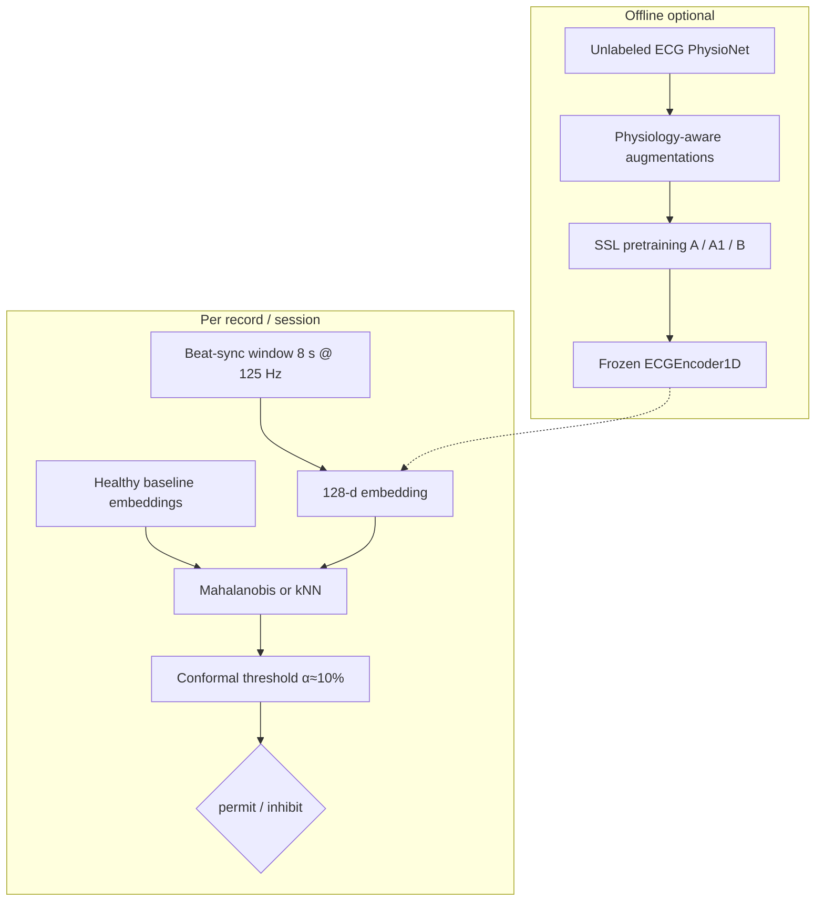

# Layer 3 — Supervisor Summary

**Master Thesis — ECG-triggered cardiac stimulation safety**  
Last updated: July 2026. Companion to `LAYER3_SUPERVISOR_DECK.pptx` and  
`LAYER3_SCIENTIFIC_REVIEW_BRIEF.md`.

---

## Role in one sentence

Layer 3 is an **optional learned safety veto**: it embeds a beat-synchronous ECG window and inhibits stimulation if the embedding is too far from the **subject/session healthy baseline**. It is **not** an arrhythmia classifier and **never commands stimulation**.

```text
permit = Layer1_safe AND Layer2_safe AND (Layer3_safe OR Layer3_disabled)
uncertainty / server failure → inhibit
```

**Layer 2 and Layer 3 are independent vetoes.** Neither borrows features from the other. The final AND is at decision time only. Primary deploy path remains **Layer 1 + Layer 2**; Layer 3 tests whether SSL embeddings add value.

**Scope:** Layer 1 = animals ± humans; Layer 2 = pigs/humans; Layer 3 = **human research only** (PhysioNet proxy). Layer 3 is **not** claimed animal- or stim-artifact-ready.

---

## Pipeline (ZEROSHOT-style personalization)




| Stage                  | Setting                                               | Why                                                       |
| ---------------------- | ----------------------------------------------------- | --------------------------------------------------------- |
| SSL pretrain           | **8 s @ 125 Hz**                                      | Rhythm + morphology in the waveform                       |
| Layer 3 veto (primary) | **8 s beat-sync @ 125 Hz**                            | Layer 3 must carry rhythm itself (independent of Layer 2) |
| Morphology ablation    | **1 s**                                               | Optional; not the primary claim                           |
| Calibration            | Healthy-only, per record                              | Yu / ZEROSHOT-style; no DANGEROUS labels for threshold    |
| Cadence                | Project **1-in-8** (observe 7, stim opportunity on 8) | Therapy policy for whole stack, not Layer-3-specific      |


**Honest limitation:** PhysioNet pretrain and Phase 1 eval may **overlap at record level**. Do not claim “unseen patient” unless records are held out of pretrain.

---

## Phase 1 encoder arms (fixed downstream scorer)

All arms share the same healthy-baseline Mahalanobis/kNN + conformal scorer so we isolate **representation quality**.


| Arm    | Method                                                         | Why                                                                   |
| ------ | -------------------------------------------------------------- | --------------------------------------------------------------------- |
| **A0** | Layer 2 **features only** + **same** Mahalanobis/kNN/conformal | Representation control — **not** the full Layer 2 hard-rule gate      |
| **A**  | NT-Xent / SimCLR-style (CLOCS-inspired)                        | Standard contrastive SSL baseline                                     |
| **A1** | VICReg non-contrastive                                         | Negative-free; may condition embeddings better for covariance scoring |
| **B**  | Masked recon + subject-contrastive (ZEROSHOT-inspired)         | Closest literature template: SSL → personalized Mahalanobis           |
| **C**  | Multi-lead upper bound                                         | Appendix only if time                                                 |


Dual-scale (1 s + 8 s concat) = **future improvement**, not required before first cluster campaign.

---

## Metrics (what we report)

- **Primary:** false-permit rate on **DANGEROUS** rhythms (VT/VF/noise)  
- **Uncertainty:** beat-level Wilson CIs **and** record-level / record-bootstrap CIs (beats in one record are correlated)  
- **Secondary:** healthy-permit (therapy availability)  
- **Policy-aware:** rates under 1-in-8 cadence when evaluated  
- **Not sufficient alone:** AUROC — anomaly ≠ clinical danger

Trigger modes: **oracle** (upper bound) and `**layer1_adaptive_gated`** (pipeline-relevant). Emphasize L1-gated for stimulation claims.

Public human ECG = **proxy validation** for Layer 3 (human research scope).

---

## Deployment framing


| Path                    | Layers                                  |
| ----------------------- | --------------------------------------- |
| Embedded / fast loop    | Layer 1 + Layer 2 (must work alone)     |
| Optional server         | Layer 3 veto if available               |
| Server down / uncertain | inhibit (or Layer 3 disabled by policy) |


---

## Status (July 2026)


| Done                                                                                                                              | Next (gate first)                                                                                     |
| --------------------------------------------------------------------------------------------------------------------------------- | ----------------------------------------------------------------------------------------------------- |
| Encoder, SSL arms A / A1 / B, Mahalanobis/kNN, beat-sync validation, conformal default, smoke test, `count_transition_records.py` | **Step 0:** freeze n_DANGEROUS / transitions → then pilot → full A0/A/A1/B at **8 s** only if powered |


---

## Where to read more


| Topic                                                     | File                                |
| --------------------------------------------------------- | ----------------------------------- |
| **Medium consolidated summary (papers, gold, ablations)** | `LAYER3_CONSOLIDATED_SUMMARY.md`    |
| Critical review brief (AI / external)                     | `LAYER3_SCIENTIFIC_REVIEW_BRIEF.md` |
| Algorithm detail                                          | `../ALGORITHM_SUMMARY.md`           |
| Design rationale                                          | `LAYER3_ARCHITECTURE_RATIONALE.md`  |
| Run validation                                            | `README_LAYER3_VALIDATION.md`       |
| Cluster + Step 0 gate                                     | `ZEROSHOT_CLUSTER_RUN_NOTES.md`     |
| Pre-registration / CAV metrics                            | `LAYER3_PHASE1_PREREGISTRATION.md`  |
| Reviewer C1–C5 (power, independence, …)                   | `LAYER3_REVIEW_WEAKNESSES_C1_C5.md` |
| Caveats                                                   | `LAYER3_REVIEW_AND_OPEN_ISSUES.md`  |
| Slides                                                    | `LAYER3_SUPERVISOR_DECK.pptx`       |


**Do not use** `archive/superseded/ZEROSHOT_LAYER3_SUPERVISOR_SUMMARY.md`.