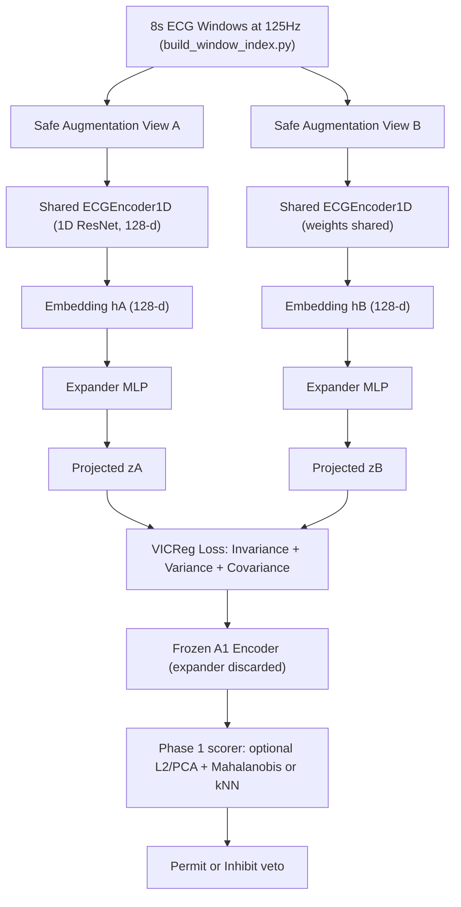

# Layer 3 VICReg (A1) Implementation Plan

> **STATUS: IMPLEMENTED** (July 2026) — code in `Layer3/pipeline/layer3_vicreg.py`,
> `--ssl-objective vicreg` in `Layer3/tools/pretrain_encoder.py`. This document
> remains the design reference for the A1 arm; do not fork a second spec.

Companion to `ZEROSHOT_CLUSTER_RUN_NOTES.md` and
`LAYER3_ARCHITECTURE_RATIONALE.md`. This document defines **A1**, a
VICReg-style non-contrastive self-supervised encoder, as a negative-free
bridge between the current **A** (NT-Xent) arm and the masked-reconstruction
**B** arm. The older subject/record-contrastive variant is now **B1** ablation.

This is a design + implementation plan. The downstream safety decision does
not change: A1 only swaps the encoder pretraining objective. The permit/inhibit
veto still comes from a healthy-baseline embedding distance.

---

## 0. Safety framing (unchanged by A1)

A1 must respect every existing Layer 3 guardrail:

- Layer 3 can only **inhibit**; it never commands stimulation.
- The runtime score stays the same transparent path:
`embedding -> optional L2 + PCA -> Mahalanobis/kNN -> threshold -> permit/inhibit`.
- **No** VICReg loss term, projection output, or embedding statistic is ever used
directly as a permit signal. VICReg is training-only; the projector/expander is
discarded after pretraining, exactly like the B-arm decoder.
- Deployable thresholds use **healthy calibration only**. DANGEROUS labels are
offline evaluation only.
- Uncertainty, encoder/checkpoint failure, or insufficient healthy calibration
-> **inhibit**.

A1 changes representation learning only. If it cannot beat A on the safety
metric, it stays an ablation.

---

## 1. Why VICReg for A1 (and not BYOL)

The arm ladder is meant to isolate *how much the SSL objective family matters*
for the safety veto, while holding the encoder and downstream scorer fixed:

```text
A  = contrastive with explicit negatives (NT-Xent / SimCLR / CLOCS-style)
A1 = non-contrastive, no negatives, no reconstruction (VICReg)
B  = masked reconstruction + non-contrastive same-window consistency
B1 = masked reconstruction + subject/record alignment (ZEROSHOT-inspired ablation)
```

VICReg is the preferred A1 objective for this thesis stage because:

- **No negative pairs.** In ECG, "negatives" sampled in-batch can accidentally be
physiologically near-identical healthy beats. NT-Xent pushes those apart, which
can distort the healthy embedding cloud we later model with Mahalanobis/kNN.
- **No EMA teacher / predictor.** BYOL needs an online encoder, a target encoder,
an EMA momentum schedule, and a predictor head. That is more moving parts,
more hyperparameters, and harder reproducibility for a thesis pipeline.
- **Explicit anti-collapse.** VICReg's variance and covariance terms directly keep
the embedding spread out and de-correlated. For anomaly detection we *want* a
healthy cloud with well-conditioned covariance, which is exactly what the
Mahalanobis baseline consumes.
- **Same data path as A.** VICReg reuses the existing two-augmented-views dataset
and safe augmentations, so A vs A1 is a clean, controlled comparison.

BYOL / DINO remain a later ablation (see `LAYER3_ARCHITECTURE_IMPROVEMENTS.md`
2.2b) if VICReg is unstable or underperforms.

Barlow Twins is a close relative; VICReg is chosen because its variance term is
more explicit and easier to reason about for a healthy-cloud anomaly model.

---

## 2. Arm taxonomy after A1


| Arm    | Encoder pretraining                 | Role                   | Status                                                  |
| ------ | ----------------------------------- | ---------------------- | ------------------------------------------------------- |
| **A0** | none (Layer 2 handcrafted features) | control floor          | implemented (Phase 1 `a0` arm)                          |
| **A**  | NT-Xent / CLOCS-style contrastive   | contrastive baseline   | implemented (`--ssl-objective ntxent`)                  |
| **A1** | VICReg non-contrastive              | negative-free baseline | this plan (`--ssl-objective vicreg`)                    |
| **B**  | MAE + same-window consistency       | masked reconstruction  | implemented (`--ssl-objective mae_consistency`) |
| **B1** | MAE + subject-contrastive           | ZEROSHOT-inspired      | ablation (`--ssl-objective mae_subject_contrastive`) |
| **C**  | supervised contrastive (SupCon), labels at pretrain only | supervised representation test | implemented (`--ssl-objective supcon`) |
| _multi-lead_ | multi-lead upper bound        | deferred appendix (not Arm C) | deferred                                          |


All arms share the identical downstream scorer so any difference is attributable
to the representation, not the decision rule.

---

## 3. Architecture flow




Key points:

- The **encoder is shared** across both views (Siamese), same as A.
- The **expander/projector** is training-only and thrown away, so checkpoints keep
saving `encoder_state_dict` only (identical convention to A and B).
- Everything downstream of `trainedEncoder` is byte-for-byte the existing
validation path in `run_beat_validation.py` / `run_window_validation.py`.

---

## 4. VICReg loss design

Given two augmented views of a batch, expanded to `z_a, z_b` of shape `(N, D)`:

```text
total = lambda_inv * invariance(z_a, z_b)
      + mu_var     * variance(z_a) + variance(z_b)
      + nu_cov     * covariance(z_a) + covariance(z_b)
```

- **Invariance** (`sim`): mean squared error between `z_a` and `z_b`. Pulls the
two augmented views of the same window together.
- **Variance** (`std`): hinge on the per-dimension standard deviation,
`mean(relu(gamma - std(z)))`, with `gamma = 1.0`. Prevents collapse to a
constant embedding.
- **Covariance** (`cov`): sum of squared off-diagonal entries of the embedding
covariance matrix, divided by `D`. Decorrelates dimensions so the healthy cloud
is well-conditioned for Mahalanobis.

Default coefficients follow the VICReg paper:

```text
lambda_inv = 25.0
mu_var     = 25.0
nu_cov     = 1.0
```

Expander default: a small MLP `128 -> 512 -> 512 -> 512` (configurable), matching
the "expander is wider than the embedding" VICReg convention. This is separate
from the NT-Xent `ProjectionHead` so A and A1 stay independent.

Numerical notes to encode in the implementation:

- variance uses `sqrt(var + eps)` with `eps = 1e-4` for gradient stability;
- covariance uses `N - 1` normalization and requires `N >= 2` (drop-last batch is
already enabled in the loader);
- loss returns finite values for a degenerate all-zero batch (guarded).

---

## 5. Integration points (implementation checklist)

The following will be needed when the code step is approved. No behavior of A or
B changes.

1. `**Layer3/pipeline/layer3_vicreg.py**` (new, mirrors `layer3_masked_ssl.py`):
  - `VICRegConfig` dataclass (`embedding_dim`, `expander_dims`, `sim_coeff`,
   `var_coeff`, `cov_coeff`, `var_gamma`, `eps`).
  - `VICRegExpander(nn.Module)` MLP with BN + ReLU between layers.
  - `vicreg_loss(z_a, z_b, cfg) -> (total, logs)` returning the three components.
  - `VICRegModel(nn.Module)` wrapping `encoder` + `expander`, `forward(x_a, x_b)`.
  - `__main__` smoke test asserting finite loss and non-collapsing variance,
  matching the style of `layer3_masked_ssl.py`.
2. `**Layer3/tools/pretrain_encoder.py**`:
  - Add `"vicreg"` to `--ssl-objective` choices.
  - Add CLI args: `--vicreg-sim-coeff` (25.0), `--vicreg-var-coeff` (25.0),
  `--vicreg-cov-coeff` (1.0), `--vicreg-expander-dims` (e.g. `512,512,512`).
  - Extend `PretrainConfig` with the same fields.
  - In `pretrain()`, build `VICRegModel` when `ssl_objective == "vicreg"`.
  - VICReg needs **two augmented views**, so use the existing
  `ContrastiveECGDataset` with `apply_augmentations=True` (same as `ntxent`),
  returning `(a, p)`; no `subject_id` needed.
  - Reuse the existing AdamW + cosine schedule + warmup and the
  `encoder_state_dict`-only checkpoint saver. Add `ssl_objective: "vicreg"` to
  the checkpoint metadata.
  - Log the three loss components at `log_every_n_steps` (like the recon/subj log
  line for B).
3. `**Layer3/pipeline/layer3_augmentations.py`**: no change; reuse the safe
  single-lead augmentation preset (`AugmentConfig` defaults).
4. `**Layer3/validation/run_beat_validation.py` and `run_window_validation.py**`:
  no change. A1 is just another checkpoint passed via `--checkpoint`.
5. `**Layer3/tools/smoke_test_layer3.py**`: add an optional
  `LAYER3_SMOKE_VICREG=1` branch that runs 1 short epoch of
   `--ssl-objective vicreg` and asserts `encoder_last.pt` exists, mirroring the
   existing `LAYER3_SMOKE_MAE` branch.

---

## 6. Proposed cluster commands

### 6.1 Reuse the existing 8 s / 125 Hz window index

A1 uses the same index as A and B (see `ZEROSHOT_CLUSTER_RUN_NOTES.md` step 1):

```bash
# Results/layer3/window_index/layer3_windows_8s_125hz.csv
```

### 6.2 Train A1: VICReg (seeds 0/1/2)

```bash
for SEED in 0 1 2; do
  python Layer3/tools/pretrain_encoder.py \
    --window-index Results/layer3/window_index/layer3_windows_8s_125hz.csv \
    --checkpoint-dir Results/layer3/pretrain/vicreg_seed${SEED} \
    --ssl-objective vicreg \
    --positive-mode same_window \
    --vicreg-sim-coeff 25.0 \
    --vicreg-var-coeff 25.0 \
    --vicreg-cov-coeff 1.0 \
    --vicreg-expander-dims 512,512,512 \
    --epochs 100 \
    --batch-size 256 \
    --lr 3e-4 \
    --num-workers 4 \
    --seed ${SEED} \
    --device cuda
done
```

Use `--healthy-only` as a conservative ablation if pretraining should avoid
abnormal/noise morphology.

### 6.3 Run beat-synchronous Phase 1 tables (unchanged harness)

```bash
CKPT=Results/layer3/pretrain/vicreg_seed0/encoder_last.pt
OUT=Results/layer3/validation/beat_phase1_vicreg_seed0

python Layer3/validation/run_beat_validation.py \
  --data-dir data \
  --datasets mit_bih_arrhythmia supraventricular_arrhythmia long_term_atrial_fibrillation noise_stress_test st_petersburg_12lead atrial_fibrillation creighton_vfib \
  --checkpoint ${CKPT} \
  --out-dir ${OUT} \
  --mode oracle \
  --window-s 8 \
  --target-fs 125 \
  --per-record-calibration \
  --guard-s 8 \
  --l2-normalize-embeddings \
  --pca-dim 32 \
  --phase1-eval \
  --phase1-arms a0,layer3 \
  --phase1-scorers mahalanobis,knn \
  --conformal-alpha 0.10 \
  --offline-danger-fpr-target 0.02 \
  --device cuda
```

The main permit/inhibit decision uses `--threshold-method conformal` by default;
Phase 1 still reports both conformal and healthy-quantile.

---

## 7. Definition of done

A1 graduates from candidate to reported arm only when:

- it **matches or beats A** on false-permit on DANGEROUS at matched healthy
permit, with Wilson CIs, across seeds 0/1/2 and the worst record;
- it preserves every guardrail in section 0 (causal runtime, healthy-only
calibration, fail-to-inhibit, encoder-only scoring);
- the VICReg variance term stays above the collapse floor during training (logged
per epoch), confirming non-degenerate embeddings;
- `smoke_test_layer3.py` (with `LAYER3_SMOKE_VICREG=1`) passes end-to-end;
- the winning config is written to `run_config.json` with the git SHA.

Until then A1 is an ablation next to A and B, not a deployment change.

---

## 8. Minimum checks before trusting results

```bash
python -m py_compile \
  Layer3/pipeline/layer3_vicreg.py \
  Layer3/tools/pretrain_encoder.py

python Layer3/pipeline/layer3_vicreg.py           # module smoke test
LAYER3_SMOKE_VICREG=1 python Layer3/tools/smoke_test_layer3.py
```

If local Windows blocks PyTorch, run the torch-dependent checks on the cluster
after loading the intended CUDA-enabled environment.
