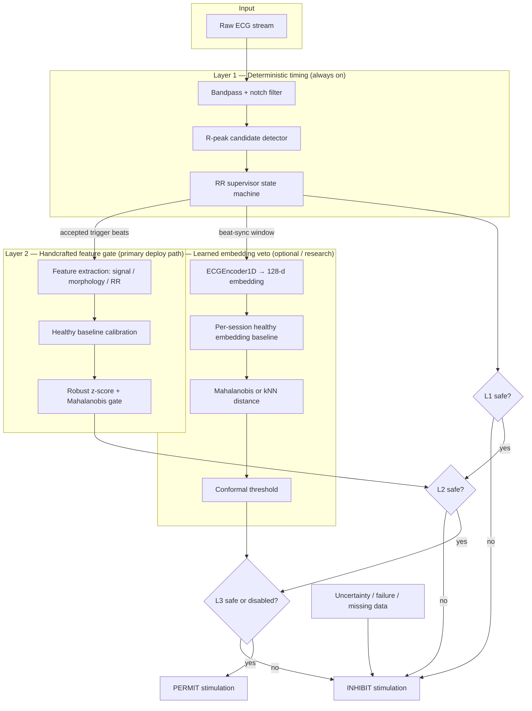
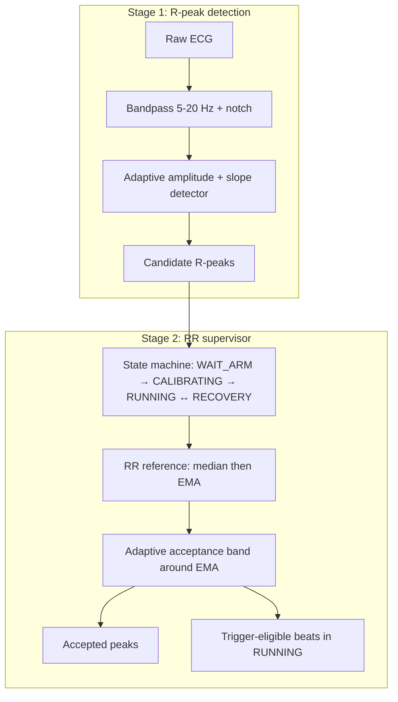
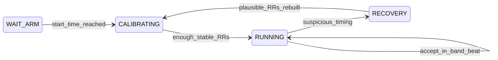
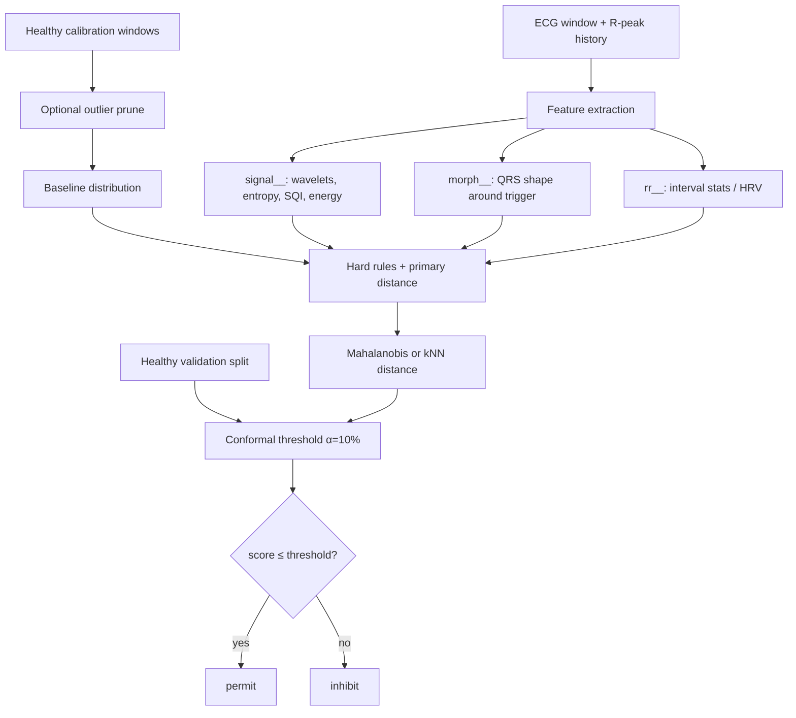
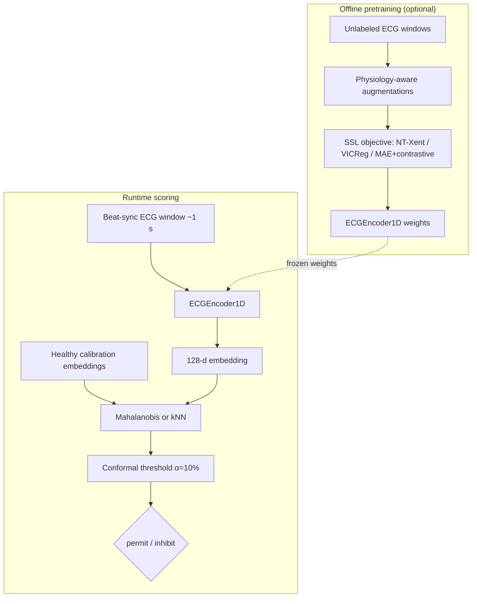
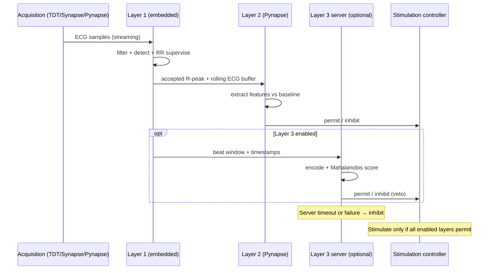

# ECG Safety Pipeline — Layers 1 to 3

**Master Thesis — ECG-triggered cardiac stimulation / MyoNeural Actuator (MNA)**

One-page architecture reference for supervisors and thesis writing.

---

## Operational question

> Is the current ECG/rhythm state safe enough to permit stimulation, or should stimulation be inhibited?

The software is **inhibit-only**: it can permit the controller to continue or **veto** stimulation. It never commands stimulation directly.

---

## Three-layer stack (overview)




**Final rule:**

```text
permit = Layer1_safe AND Layer2_safe AND (Layer3_safe OR Layer3_disabled)
```

Any uncertainty → **inhibit** (fail-safe).

---

## Layer roles at a glance


| Layer       | Role                                          | Input                | Output                                 | Deployment                    |
| ----------- | --------------------------------------------- | -------------------- | -------------------------------------- | ----------------------------- |
| **Layer 1** | Fast R-peak detection + RR/rhythm supervision | Raw ECG              | Accepted peaks, trigger-eligible beats | Always on, embedded           |
| **Layer 2** | Interpretable morphology/rhythm feature gate  | ECG window + R-peaks | permit / inhibit                       | Primary rat path              |
| **Layer 3** | Learned embedding anomaly veto                | Beat-sync ECG window | permit / inhibit                       | Optional server-side research |


---

## Layer 1 — R-peak detection and rhythm supervision

Layer 1 is the fast deterministic timing layer. It does **not** command stimulation;
it certifies which R-peaks are timing-reliable enough to pass to Layers 2 and 3.

Implementation: `Layer1/pipeline/main_pipeline.py` → `run_layer1()`

### Main idea

Layer 1 = **causal R-peak detection** + **RR supervisor with EMA rhythm reference**.

- Track successive R-peaks and measure **RR intervals** (time between consecutive peaks).
- Maintain an **exponential moving average (EMA)** of RR as the live rhythm reference.
- Accept or reject each new candidate peak if it arrives **too early or too late**
relative to that reference (adaptive acceptance band).
- Candidates come from a separate adaptive detector; the supervisor does not trust
raw detector output without RR validation.

### How it works (two stages)




#### Stage 1 — Fast causal R-peak detector

File: `Layer1/pipeline/r_peak_detector.py`

- **Causal only** at runtime: past/current samples only (no `filtfilt`, no oracle).
- **5–20 Hz bandpass** + optional 50/60 Hz notch → emphasizes QRS energy.
- **Adaptive thresholds**: amplitude and slope envelopes track noise vs signal online.
- **Peak tracking**: enter on rising edge above thresholds; emit peak after confirmed
descent (real-time confirmation delay is part of the latency budget).
- **Detector refractory** (~90 ms): suppress double detections on one QRS complex.
- Output: **candidate** peak timestamps — not yet trusted for stimulation.

#### Stage 2 — RR supervisor

File: `Layer1/pipeline/rhythm_supervisor.py`

**Four modes:**


| Mode          | What happens                                                           |
| ------------- | ---------------------------------------------------------------------- |
| `WAIT_ARM`    | Ignore first ~2 s (filter and detector warm-up)                        |
| `CALIBRATING` | Collect ~10 RR intervals; median → EMA warm-up; **no triggers**        |
| `RUNNING`     | Normal operation; accepted beats → `trigger_samples` for downstream    |
| `RECOVERY`    | After suspicious timing; wider band; no triggers until rhythm rebuilds |


**RUNNING acceptance checks (in order):**

1. Not inside **blanking/refractory** (post-beat protection; longer after stimulation).
2. **Hard RR limits**: 250–2500 ms (reject physiologically impossible rates).
3. **Adaptive band** around EMA: width from recent stable RR variability (robust MAD),
  clipped to roughly 10–40% of the current reference.

If RR is out of band → reject candidate. Repeated instability → **RECOVERY**
(conservative: no stimulation triggers until recalibrated via CALIBRATING → RUNNING).




Key defaults: `rr_ema_alpha=0.20`, `calibration_rr_count=10`, `rr_min_ms=250`,
`rr_max_ms=2500`.

### How it meets expectations

- **Causal, deterministic, conservative, very low latency** — suitable for embedded
deployment (TDT, Ripple, or custom hardware).
- **Hard physiological rules** reject impossible heart rates before any soft band logic.
- **Post-beat blanking** prevents double triggers on the same beat or immediately
after stimulation artifacts.
- **No ML, no server** — first line of defense always available even if Layer 2/3 fail.

### Limitations (motivates Layer 2 and 3)

- Effective at detecting **suspicious RR timing** or impossible beat intervals.
- Cannot judge whether the **ECG waveform shape** (morphology) is abnormal.
- Cannot assess **signal quality** (noise, lead-off, saturation) beyond gross timing failure.
- A perfectly timed PVC or fusion beat may pass Layer 1 → Layer 2/3 handle morphology.

### Outputs passed downstream

From `run_layer1()`:


| Output                 | Meaning                                               |
| ---------------------- | ----------------------------------------------------- |
| `candidate_samples`    | Raw detector peaks (before supervisor)                |
| `accepted_samples`     | Beats passing RR supervisor                           |
| `trigger_samples`      | **RUNNING-mode** beats eligible for stimulation logic |
| `supervisor.decisions` | Full decision log for debugging and plots             |


Filtered ECG and accepted R-peak timestamps are passed to Layer 2 (feature extraction)
and Layer 3 (beat-sync windows).

---

## Layer 2 — Handcrafted feature safety gate

**Purpose:** Compare current ECG features to a **healthy baseline** learned at session start. Primary interpretable safety upgrade for animal deployment.




**Calibration defaults (aligned with Layer 3):**


| Setting                    | Default       | Role                                                |
| -------------------------- | ------------- | --------------------------------------------------- |
| `threshold_method`         | `conformal`   | Held-out healthy validation scores                  |
| `conformal_alpha`          | 0.10          | Target ~10% healthy false inhibit                   |
| `calibration_outlier_frac` | 0.0           | Optional worst-window prune before refit            |
| `anomaly_model`            | `mahalanobis` | Primary distance; `knn` alternative                 |
| `guard_s`                  | 5.0 s         | Post-calibration overlap excluded from test metrics |


**Validation policy groups** (shared with Layer 3 via `label_grouping.py`):


| Group             | Examples     | Safety expectation       |
| ----------------- | ------------ | ------------------------ |
| `NORMAL`          | NSR baseline | permit                   |
| `DANGEROUS`       | VT, VFib     | inhibit (primary metric) |
| `BENIGN_ABNORMAL` | isolated PVC | policy-dependent         |
| `AF_CONTEXT`      | AF spans     | configurable             |
| `NOISE`           | artifact     | inhibit                  |


**Feature groups:**


| Prefix     | Needs R-peaks? | Safety meaning                |
| ---------- | -------------- | ----------------------------- |
| `signal__` | No             | noise, energy, signal quality |
| `morph__`  | Yes            | PVC, aberrant beat shape      |
| `rr__`     | Yes (≥2 peaks) | rhythm deterioration          |


**Prospective 1-in-8 policy (rat stimulation strategy):**

- Beats 1–7: observe unstimulated beats, score safety
- Beat 8: stimulate only if the observation block is safe enough
- The 8th beat is not re-analysed before firing — decision is already stored

**Main entry:** `Layer2/pipeline/main_pipeline.py` → `extract_layer2_features()`, `calibrate_layer2()`, `decide_layer2()`

---

## Layer 3 — Learned embedding anomaly veto

**Purpose:** Research extension. Pretrain a small 1D ResNet encoder with self-supervised learning, then score beat morphology as distance from a **personalized healthy embedding baseline**. Optional veto — not required for the immediate safety loop.




**Phase 1 encoder comparison arms** (fixed downstream scorer isolates representation quality):


| Arm | Method                                        |
| --- | --------------------------------------------- |
| A0  | Layer 2 handcrafted features (control)        |
| A   | NT-Xent contrastive SSL                       |
| A1  | VICReg non-contrastive SSL                    |
| B   | MAE + subject-contrastive (ZEROSHOT-inspired) |
| C   | Multi-lead upper bound (appendix)             |


**Primary safety metric:** false-permit rate on **DANGEROUS** beats (VT/VFib/noise), with Wilson confidence intervals. Secondary: healthy-permit (therapy availability).

**Main entry:** `Layer3/validation/run_beat_validation.py`

---

## Real-time architecture (deployment view)




**Buffers the caller must maintain:**


| Buffer              | Typical size            | Layer  |
| ------------------- | ----------------------- | ------ |
| ECG morphology      | ~5 s + post-R lookahead | L2     |
| RR history          | ~30 s accepted peaks    | L2     |
| Beat-sync window    | ~1 s @ 125 Hz           | L3     |
| Healthy calibration | session start, 2–5 min  | L2, L3 |


---

## Safety rules (all layers)

1. Software can only **inhibit** — never command stimulation autonomously
2. **Uncertainty → inhibit** (missing data, NaN score, failed calibration, server timeout)
3. **False permit** is the primary safety error; false inhibit is secondary
4. Layer 1 deterministic logic remains the first line of defense
5. Non-causal filtering is offline-only; runtime must be causal or explicitly labelled
6. Human PhysioNet validation is **proxy** validation; rat deployment needs per-session calibration

---

## Validation status


| Layer   | Human ECG validation               | Rat deployment                    |
| ------- | ---------------------------------- | --------------------------------- |
| Layer 1 | Multi-dataset R-peak benchmark     | Causal mode ready                 |
| Layer 2 | Beat/window validation on MIT-BIH  | Primary planned deploy path       |
| Layer 3 | Beat-sync Phase 1 arms (A0/A/A1/B) | Research; session calibration TBD |


---

## Where to read more


| Topic                    | Document                                          |
| ------------------------ | ------------------------------------------------- |
| Layer 1 algorithm        | `Layer1/ALGORITHM_SUMMARY.md`                     |
| Layer 2 algorithm        | `Layer2/ALGORITHM_SUMMARY.md`                     |
| Layer 3 algorithm        | `Layer3/ALGORITHM_SUMMARY.md`                     |
| Layer 3 design rationale | `Layer3/reports/LAYER3_ARCHITECTURE_RATIONALE.md` |
| Layer 3 doc index        | `Layer3/reports/README.md`                        |
| Supervisor slides        | `Layer3/reports/LAYER3_SUPERVISOR_DECK.pptx`      |
| Project safety rules     | `CLAUDE.md`                                       |


---

*Generated for thesis documentation. Mermaid diagrams render in GitHub, VS Code, Obsidian, and Marp.*