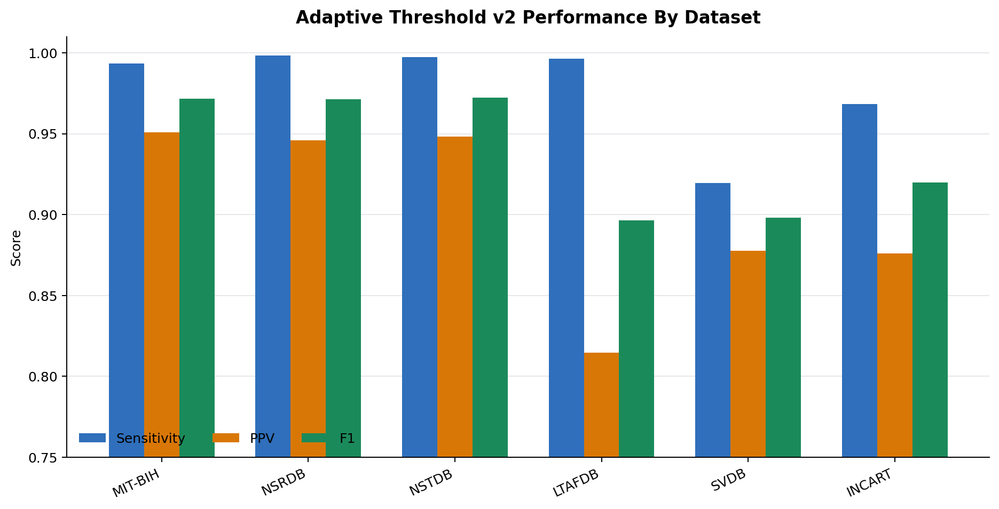
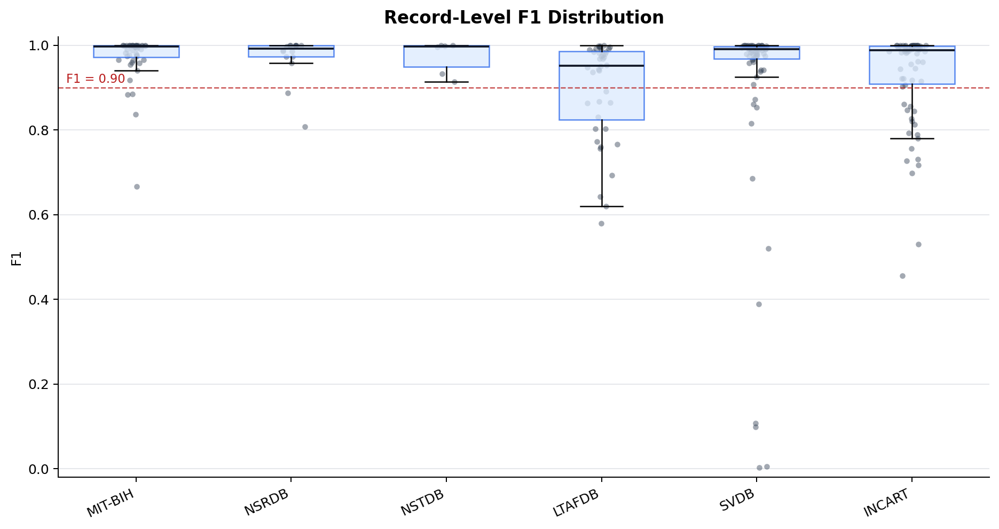
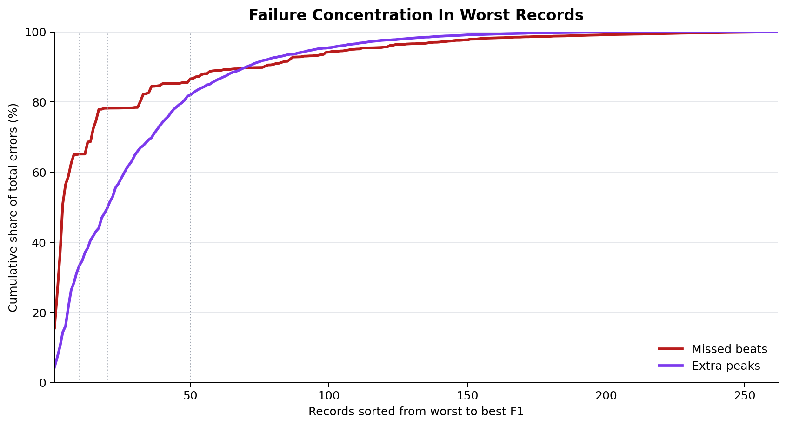
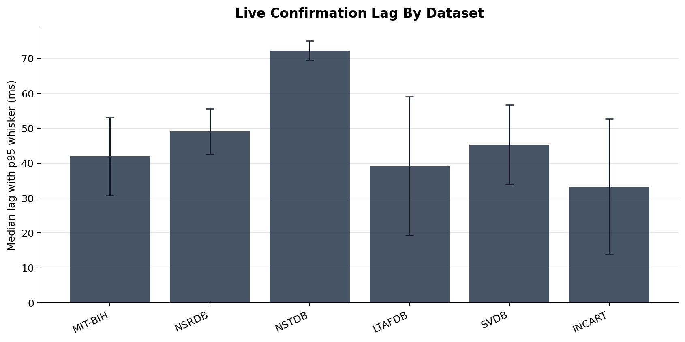
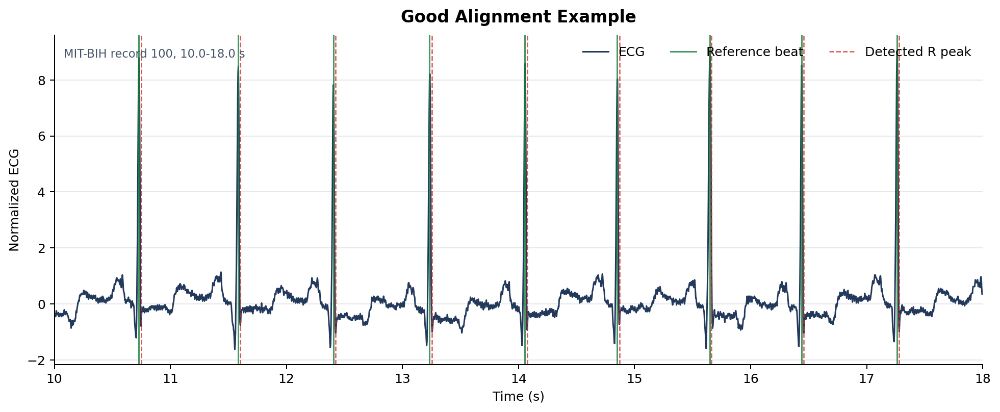
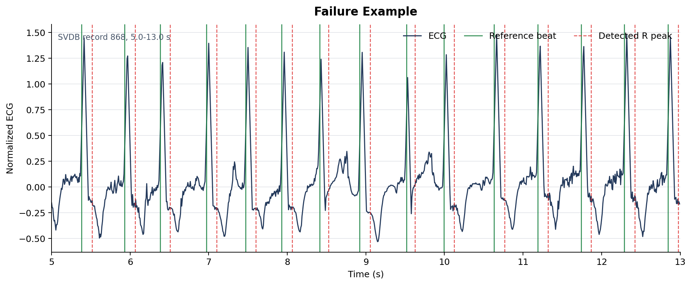

# R-Peak Detection Report

This report summarizes `adaptive_threshold_v2` on the default beat-annotated
R-peak benchmark datasets.

Source benchmark folder:

```text
Results\rpeak_comparison\adaptive_v2_default_datasets_20260618
```

## Key Figures









## ECG Examples





## Dataset Summary

| Dataset | Records | Beats | Sensitivity | PPV | F1 | Median Live Lag (ms) | Note |
|---|---|---|---|---|---|---|---|
| MIT-BIH | 48 | 109150 | 0.9933 | 0.9510 | 0.9717 | 41.91 | strong development-set performance |
| NSRDB | 16 | 38412 | 0.9984 | 0.9459 | 0.9714 | 49.06 | strong on mostly sinus rhythm |
| NSTDB | 6 | 12756 | 0.9973 | 0.9483 | 0.9722 | 72.26 | robust at SNR >= 12 dB |
| LTAFDB | 40 | 89557 | 0.9965 | 0.8148 | 0.8965 | 39.19 | high sensitivity, many extra peaks |
| SVDB | 78 | 184583 | 0.9196 | 0.8775 | 0.8980 | 45.34 | bad-tail failures dominate |
| INCART | 74 | 173544 | 0.9685 | 0.8761 | 0.9200 | 33.28 | domain and lead morphology shift |

## Worst Records

| Dataset | Record | F1 | PPV | Sensitivity | Extra | Missed | Failure Mode |
|---|---|---|---|---|---|---|---|
| SVDB | 868 | 0.0027 | 0.0027 | 0.0027 | 3348 | 3339 | catastrophic mismatch |
| SVDB | 869 | 0.0051 | 0.0051 | 0.0051 | 2148 | 2150 | catastrophic mismatch |
| SVDB | 891 | 0.0990 | 0.0987 | 0.0994 | 2366 | 2347 | catastrophic mismatch |
| SVDB | 880 | 0.1075 | 0.1075 | 0.1075 | 3114 | 3112 | catastrophic mismatch |
| SVDB | 885 | 0.3887 | 0.3753 | 0.4031 | 1315 | 1170 | misses and extra peaks |
| INCART | I03 | 0.4562 | 0.3200 | 0.7945 | 4140 | 504 | misses and extra peaks |
| SVDB | 865 | 0.5197 | 0.3968 | 0.7530 | 3620 | 781 | misses and extra peaks |
| INCART | I05 | 0.5298 | 0.4294 | 0.6914 | 1632 | 548 | misses and extra peaks |
| LTAFDB | 120 | 0.5794 | 0.4079 | 1.0000 | 2189 | 0 | extra peaks dominate |
| LTAFDB | 00 | 0.6196 | 0.4533 | 0.9785 | 1593 | 29 | extra peaks dominate |

## Tables

- `tables/dataset_summary.csv`
- `tables/worst_records.csv`
- `tables/failure_concentration.csv`
- `tables/failure_by_f1_threshold.csv`

## External Viewer

Manual waveform inspection can also be done with PhysioNet LightWAVE:
https://physionet.org/lightwave/
